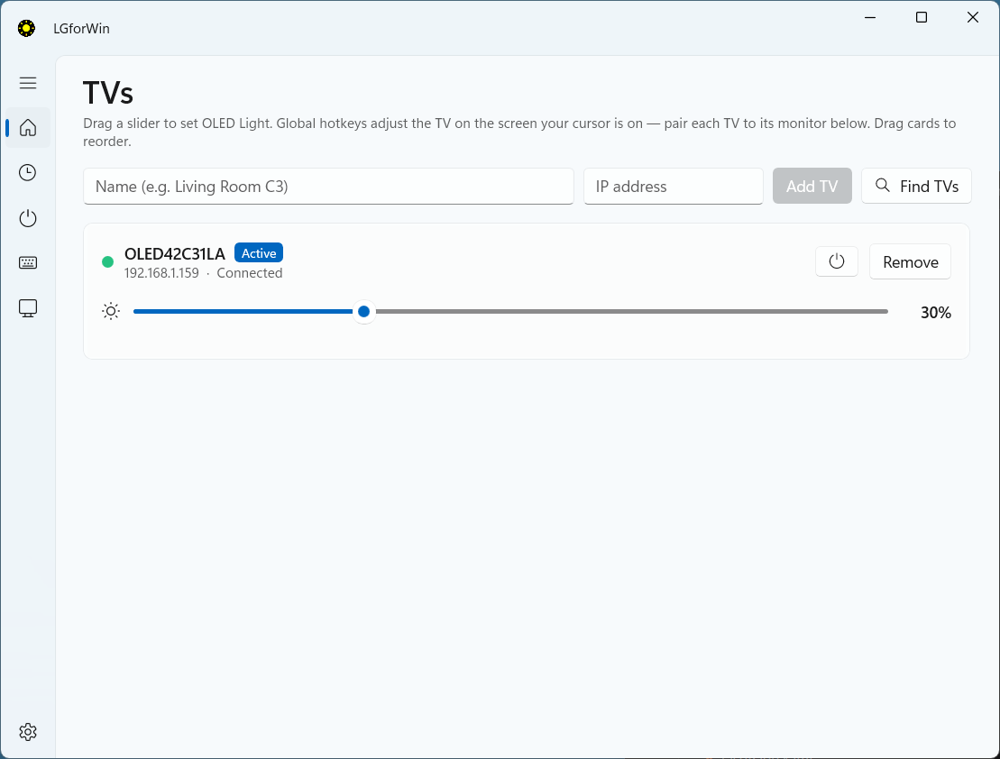
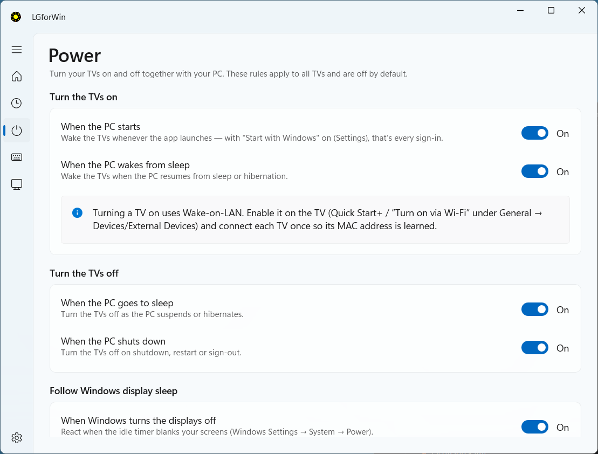
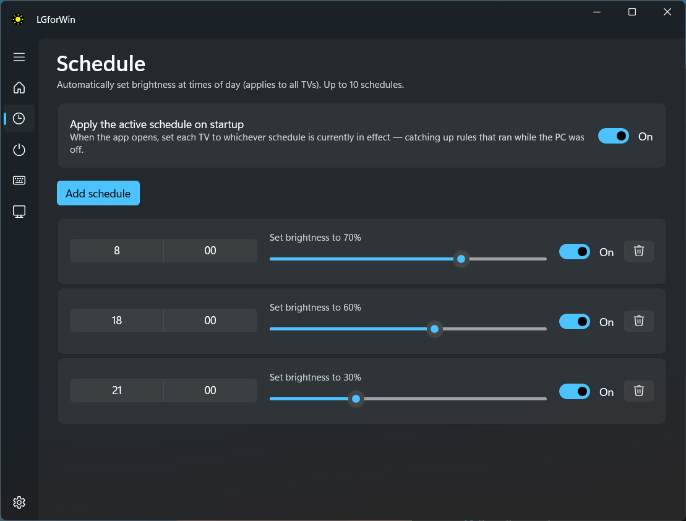
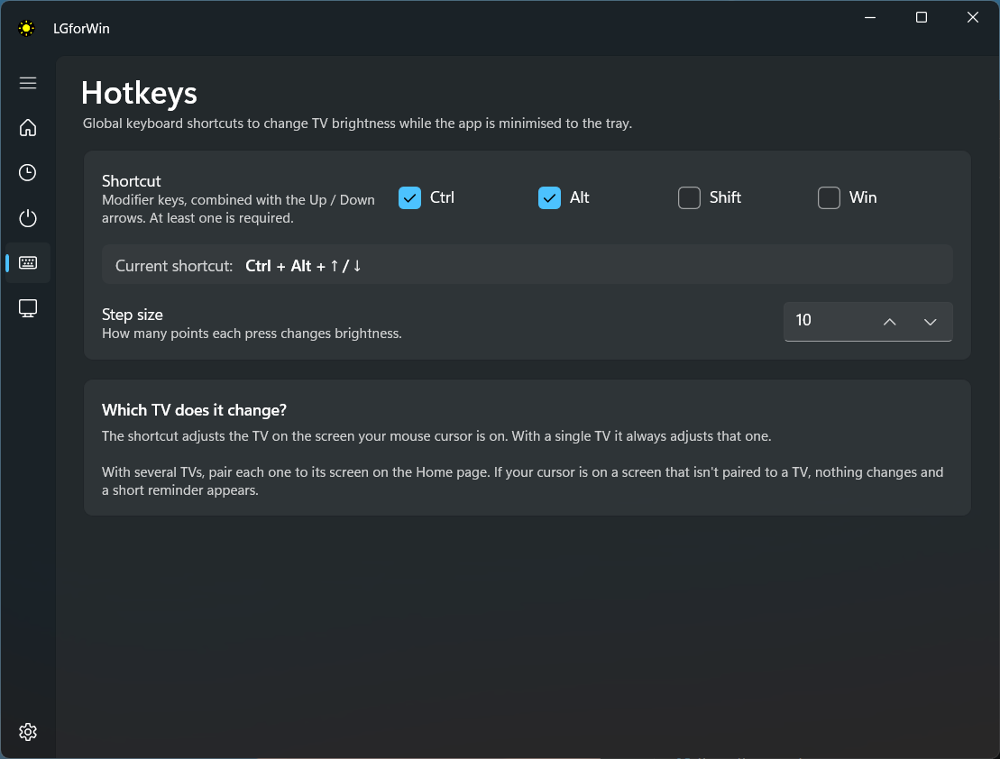
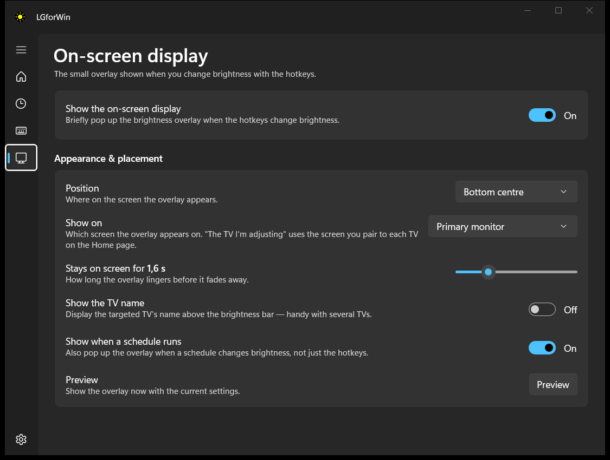
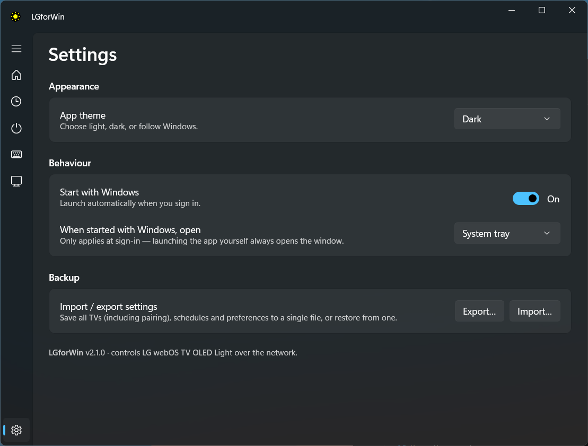

# LGforWin

A small native **WinUI 3** Windows app to control the **brightness (OLED Light)** of
LG webOS TVs used as PC monitors — C2, C3, G-series and friends — over your LAN.

OLED TVs have no DDC/CI hardware brightness, so the Windows brightness slider does
nothing. The only real "brightness" control is the TV's **OLED Light (backlight)**
picture setting. LGforWin drives that setting over the network so you can change it
from your desk — with a slider, the system tray, or global hotkeys.

<p align="center">
  
</p>

## Download

**[⬇ Download LGforWin v2.0.0](https://github.com/itsAllexB/LGforWin/releases/latest)**

| | |
|---|---|
| [`LGforWin-2.0.0-setup.exe`](https://github.com/itsAllexB/LGforWin/releases/latest/download/LGforWin-2.0.0-setup.exe) | Installer — Start-menu shortcut and an uninstall entry. |
| [`LGforWin-2.0.0-win-x64.zip`](https://github.com/itsAllexB/LGforWin/releases/latest/download/LGforWin-2.0.0-win-x64.zip) | Portable — unzip and run `LGforWin.exe`. |

64-bit Windows 10 1809 or newer. Nothing else to install — the .NET runtime and the
Windows App SDK are bundled. The build isn't code-signed yet, so SmartScreen shows an
"unrecognized app" warning on first run: choose **More info → Run anyway**.

## Features

- **Find TVs automatically** — one click scans the LAN over SSDP and adds any webOS TV
  it finds, so you never have to hunt for an IP address. Adding by IP still works.
- **Power automation** — turn the TVs on and off with the PC: at startup, on sleep,
  on shutdown, and following Windows' display-sleep timer (blank the panel for an
  instant resume, or power off fully). Waking uses Wake-on-LAN.
- Add TVs by IP; **pair once** (accept the on-screen prompt), then it reconnects
  silently forever using the stored client-key. Secure `wss://:3001` with automatic
  fallback to `ws://:3000`.
- Per-TV **OLED Light slider (0–100)** that pushes changes live (debounced).
- **Global hotkeys** (customizable combo) that adjust the TV on the screen your
  **cursor** is on — pair each TV to its Windows monitor so it knows which is which.
  Ten points per press by default, adjustable 1–25.
- **On-screen display** — a Windows 11-style brightness overlay on the hotkey, with
  configurable position, screen, duration and optional TV name.
- **Schedules** — up to 5 daily brightness rules, with catch-up on startup.
- **System tray** icon — closing hides to tray; optional **launch at sign-in**
  (normal window / minimized / tray).
- **Import / export** all settings; light / dark / system theme.
- Remembers multiple TVs, their last brightness, and the window size.

## On-screen display

Nudge brightness with the hotkeys and a Windows 11-style overlay slides in — on the
screen of the TV you're adjusting:

<p align="center">
  
</p>

## Screens

|  |  |
|:--|:--|
| **Power** — follow the PC's sleep, shutdown and display timer | **Schedules** — up to 5 daily rules |
|  |  |
| **Hotkeys** — cursor-targeted, customizable combo | **On-screen display settings** |
|  |  |
| **Settings** — theme, autostart, import/export | |
|  | |

## How it works (protocol)

webOS speaks **SSAP over a WebSocket** at `ws://<tv-ip>:3000`:

1. **Pair** — send a registration handshake. The TV shows an accept prompt and returns
   a `client-key`, which we persist and reuse so it never prompts again.
2. **Set brightness** — `ssap://com.webos.settingsservice/setSystemSettings` with
   `{ "category": "picture", "settings": { "backlight": "<0-100>" } }`.
   (Falls back to `ssap://settings/setSystemSettings` on firmware that rejects the
   internal URI.)
3. **Read current** — `ssap://settings/getSystemSettings` to initialise the slider.
4. **Power** — `ssap://system/turnOff` to switch off, and
   `…tvpower/power/turnOffScreen` / `turnOnScreen` to blank and restore just the panel.
   `…tvpower/power/getPowerState` reports `Active` / `Screen Off` / `Suspend`, which
   doubles as a liveness probe: a TV that loses power doesn't close the WebSocket, so
   without asking it we'd keep reporting "connected" to a set that's long gone.
5. **Wake** — a TV that's off can't be reached over SSAP at all, so waking is a
   Wake-on-LAN magic packet to the MAC learned via ARP while it was still reachable.
   The TV needs **Quick Start+** (or "Turn on via Wi-Fi") enabled to answer it.

Works on **stock TVs — no rooting required.** Prior art: bscpylgtv, ColorControl, lgtv2.

## Project layout

| Path | Purpose |
|------|---------|
| `Services/WebOsClient.cs` | Low-level SSAP WebSocket: connect, pair, request/response |
| `Services/TvController.cs` | Per-TV lifecycle, auto-reconnect, heartbeat, power, debounced SetBacklight |
| `Services/SsdpDiscovery.cs` | LAN scan for webOS TVs (SSDP M-SEARCH + UPnP description) |
| `Services/WakeOnLan.cs` | ARP MAC lookup + magic-packet wake |
| `Services/PowerEventService.cs` | Windows sleep / resume / display-off / shutdown notifications |
| `Services/SsapPayloads.cs` | Registration manifest + SSAP URIs |
| `Services/DeviceStore.cs` | JSON persistence in `%LOCALAPPDATA%\LGforWin` |
| `Services/HotkeyService.cs` | Global hotkeys via `RegisterHotKey` |
| `ViewModels/` | `MainViewModel`, `TvViewModel` (CommunityToolkit.Mvvm) |
| `Views/MainWindow.xaml` | TV list, sliders, add/remove, tray icon |
| `Program.cs` / `App.xaml.cs` | Custom entry point, single-instance, startup wiring |

## Building

**Prerequisites**

- .NET 8 SDK (`winget install Microsoft.DotNet.SDK.8`)
- Visual Studio 2022/2026 with the **.NET desktop development** workload (provides the
  WinUI/MSIX MSBuild tasks; the standalone .NET SDK alone is not enough).

**Build & run**

Open `LGforWin.sln` in Visual Studio and press **F5**, or from a terminal:

```powershell
pwsh -File build.ps1 -Configuration Debug -Run
```

**Package a release** — writes the portable zip and `setup.exe` to `dist\`:

```powershell
pwsh -File build.ps1 -Configuration Release -Package
```

The installer needs [Inno Setup 6](https://jrsoftware.org/isinfo.php)
(`winget install JRSoftware.InnoSetup`); without it the zip is still produced.

> Note: build with **Visual Studio's MSBuild** (what `build.ps1` does), not
> `dotnet build` — WinUI PRI generation needs the AppxPackage task that only ships
> with VS, so `dotnet build` fails with `MSB4062`.

## Usage

1. Make sure the TV is on the same network and **"LG Connect Apps" / mobile control**
   is enabled (Settings → Network/Connection).
2. Launch LGforWin and click **Find TVs** — pick yours from the list and hit **Add**.
   (Or type a name + IP and click **Add TV**.)
3. Accept the pairing prompt on the TV (one time).
4. Drag the slider — brightness changes within ~150 ms. Use `Ctrl+Alt+Up/Down` anytime.
5. Optional: on the **Power** page, choose what should happen to the TVs when the PC
   starts, sleeps, shuts down, or Windows blanks the displays.

> For the "turn on" rules, enable **Quick Start+** on the TV (General → Devices →
> External Devices, wording varies) — that's what lets it answer Wake-on-LAN. Note that
> once Windows sleeps a display it stops sending a picture, so the TV will usually
> power *itself* off on "no signal" a few minutes later even if you chose "Screen off";
> waking covers both cases.

## Roadmap

Planned features and ideas are tracked in [`Todo.md`](Todo.md).

## License

Licensed under the [GNU General Public License v3.0](LICENSE) © Alex Bolocan.
